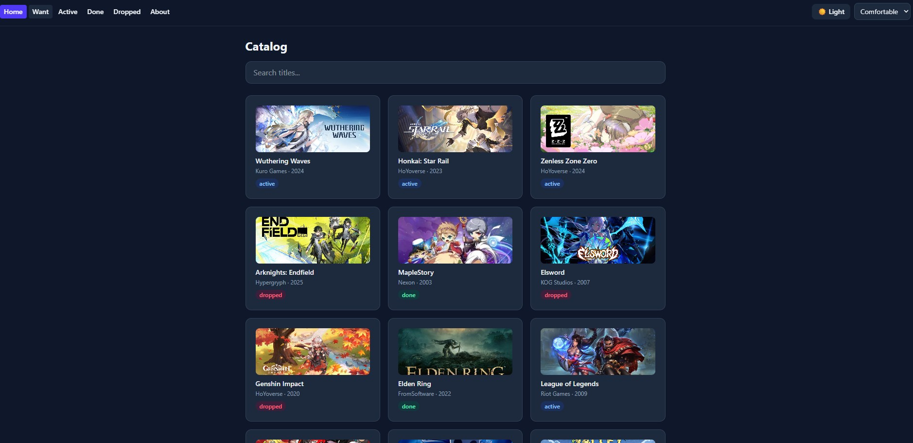
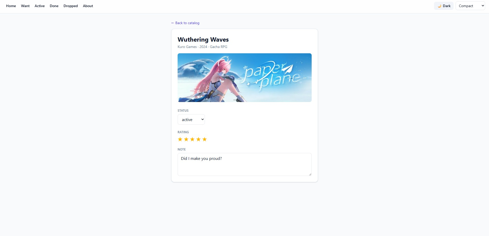
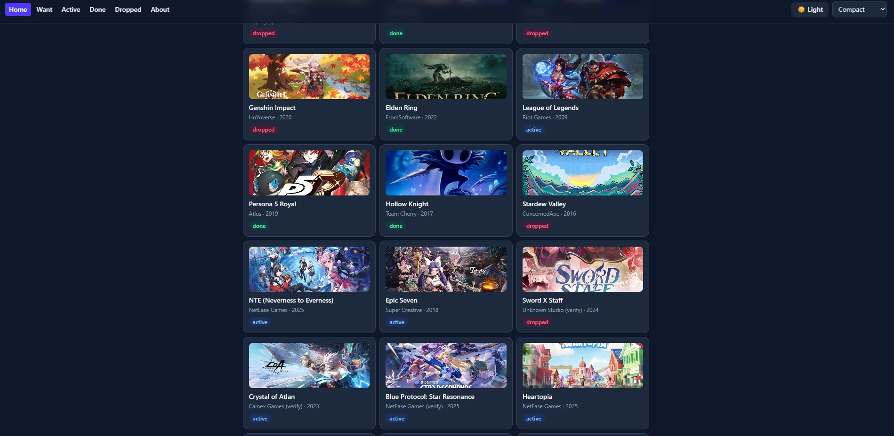

# 🎮 GameVault
 
A personal game tracker built with React, TypeScript, React Router, TanStack Query, and Zustand for CSCI 39548 – Practical Web Development (Summer 2026).
 
## Theme
 
GameVault tracks video games instead of books or movies — the games I'm currently playing, want to play, have finished, or dropped, including a mix of gacha/live-service games (Wuthering Waves, Honkai: Star Rail, Epic Seven, NTE) and single-player titles (Elden Ring, Hades, Hollow Knight).
 
## Features
 
- **Catalog page** — browse all games, with a live search box that filters by title.
- **Status-filtered pages** — `/list/want`, `/list/active`, `/list/done`, `/list/dropped`, each with its own search box.
- **Item detail page** — view a single game's full info, change its status via dropdown, rate it 1–5 stars, and edit a personal note.
- **URL-driven search** — the search term lives in `?q=...`, so refreshing or sharing a link preserves what you searched.
- **Theme + density toggle** — light/dark mode and compact/comfortable layout density, both persisted across reloads.
- **Loading + error states** — every data-fetching page shows a loading message while fetching and a friendly error message on failure, instead of crashing.
- **404 page** — any unmatched URL shows a "Not Found" page instead of breaking.
- **Cover images** — games can optionally have a small thumbnail (catalog/status grids) and a separate detail-page image.
## Tech Stack
 
| Tool | Purpose |
|------|---------|
| [Vite](https://vitejs.dev/) | Build tool / dev server |
| [React 19](https://react.dev/) | UI library |
| [TypeScript](https://www.typescriptlang.org/) | Type safety |
| [React Router](https://reactrouter.com/) | Client-side routing, URL params, search params |
| [TanStack Query](https://tanstack.com/query) | Data fetching, caching, mutations |
| [Zustand](https://zustand-demo.pmnd.rs/) | Global UI state (theme, density) with `persist` |
| [Tailwind CSS v4](https://tailwindcss.com/) | Utility-first styling, dark mode |
| [json-server](https://github.com/typicode/json-server) | Fake REST API over `db.json` |
 
## Getting Started
 
This project needs **two terminals running at the same time**.
 
```bash
# 1. Install dependencies
npm install
```
 
**Terminal A — fake backend:**
```bash
npm run server
```
Serves `db.json` at `http://localhost:3001`.
 
**Terminal B — the app:**
```bash
npm run dev
```
Open [http://localhost:5173](http://localhost:5173) in your browser.
 
To reset the data back to the original seed set at any time:
```bash
npm run reset-db
```
 
## Project Structure
 
```
src/
├── types.ts              # Shared TypeScript interfaces (Game, GameStatus)
├── api.ts                # Fetch/mutation functions talking to json-server
├── store.ts               # Zustand store (theme, density) with persist
├── App.tsx                # Nav bar, theme/density controls, route definitions
├── main.tsx                # Entry point — BrowserRouter + QueryClientProvider setup
└── pages/
    ├── Catalog.tsx          # "/" — full game list with search
    ├── ItemDetail.tsx        # "/items/:id" — single game, status/rating/note mutations
    ├── StatusList.tsx         # "/list/:status" — filtered list with search
    ├── About.tsx               # "/about" — static about page
    └── NotFound.tsx             # "*" — 404 catch-all
db.json          # Live data (rewritten by json-server on every mutation)
db.seed.json      # Untouched backup, restored via npm run reset-db
```
 
## Screenshots
 
_Add 1–3 screenshots here before submitting — e.g. the catalog grid, the item detail page, and dark mode. Take these after running `npm run reset-db` so the data shown is clean._
 
```md



```
 
## Stretch Features
 
None attempted — this submission covers the core 100-point rubric (routing, TanStack Query, Zustand, Tailwind styling, README, code clarity).
 
## Git Workflow
 
Development followed the feature-branch workflow taught in class:
 
1. Initial commit on `main` with scaffold + seed data
2. Feature branch `feature/core-app` for all development work
3. Incremental commits at each milestone (routing → TanStack Query → Zustand → Tailwind styling → images/data polish)
4. Pull request merged into `main`
## Assignment
 
Jia Cheng Zhao
CSCI 39548 – Practical Web Development, Summer 2026
Instructor: Sourya Saha
Assignment 4 – GameVault (Router · Zustand · TanStack Query)